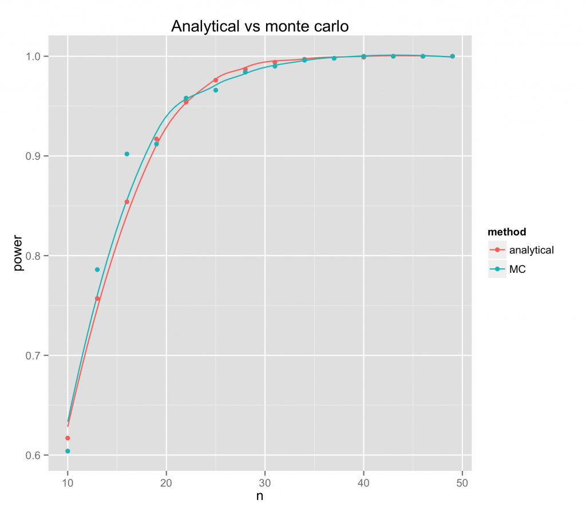

In this post I show some R-examples on how to perform power analyses for
mixed-design ANOVAs. The first example is analytical — adapted from
formulas used in G\*Power (Faul et al., 2007), and the second example is
a Monte Carlo simulation. The source code is embedded at the end of this
post.

Both functions require a dataframe, containing the parameters that will
be used in the power calculations. Here is an example using three groups
and three time-points.  

```r
# design -------
# mus
CT <- c(34.12, 21, 17.44)
BA <- c(36.88, 16.82, 8.75) 
ADM <- c(35.61, 14.39, 7.78)
 
study <- data.frame("group" = gl(3,3, labels=c("CT", "BA", "ADM")))
study$time <- gl(3,1,9, labels=c("Intake", "8 weeks", "16 weeks"))
 
study$DV <- c(CT, BA, ADM) 
study$SD <- 10
 
ggplot(study, aes(time, DV, group=group, linetype=group, shape=group)) + 
    geom_line() + 
    geom_point()
```

Here is a plot of our hypothetical study design.  

Now, we will use this design to perform a power analysis using
`anova.pwr.mixed` and `anova.pwr.mixed.sim`.  

```r
# analytical ----------
anova.pwr.mixed(data = study, Formula = "DV ~ time*group",
 n=10, m=3, rho=0.5)
```
```rout
       Terms      power n.needed
    b  group      0.197       NA
    w1 time       1.000       NA
    w2 time:group 0.617       NA
```
```r
# monte carlo ------------
anova.pwr.mixed.sim(data=study, Formula="DV ~ time*group + Error(subjects)",
 FactorA="group", n=10, rho=0.5, sims=100)
```
```rout

           terms power
    1  group      0.19
    2 time        1.00
    3 time:group  0.64
```

Comparison of analytical and monte carlo power analysis
-------------------------------------------------------

Now let's compare the two functions' results on the time x
group-interaction. Hopefully, the two methods will yield the same
result.  

```r 
# compare
samples <- seq(10,50,3) # n's to use
analytical <- matrix(ncol=2, nrow=length(samples))
colnames(analytical) <- c("power", "n")
for(i in samples) { 
  j <- which(samples == i)
  analytical[j,1] <- anova.pwr.mixed(data = study, Formula = "DV ~ time*group", n=i, m=3, rho=0.5)$power[3]
  analytical[j,2] <- i
}
   
MC <- matrix(ncol=2, nrow=length(samples))
colnames(MC) <- c("power", "n")
for(i in samples) { 
  j <- which(samples == i)
  MC[j,1] <- anova.pwr.mixed.sim(data=study, Formula="DV ~ time*group + Error(subjects)", FactorA="group", n=i, rho=0.5, sims=500)$power[3]
  MC[j,2] <- i
}
 
# plot
MC <- data.frame(MC)
MC$method <- "MC"
analytical <- data.frame(analytical)
analytical$method <- "analytical"
df <- rbind(analytical, MC)
 
ggplot(df, aes(n, power, group=method, color=method)) + geom_smooth(se=F) + geom_point()
```



Luckily, the analytical results are consistent with the Monte Carlo
results.

References
----------

Faul, F., Erdfelder, E., Lang, A. G., & Buchner, A. (2007). G\* Power 3:
A flexible statistical power analysis program for the social,
behavioral, and biomedical sciences.*Behavior research methods*, 39(2),
175-191.

Source code
-----------

You can find the source [here](https://gist.github.com/rpsychologist/5618891) and [here](https://gist.github.com/rpsychologist/5618888).
