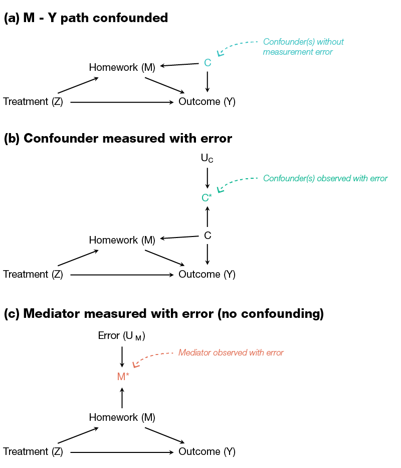
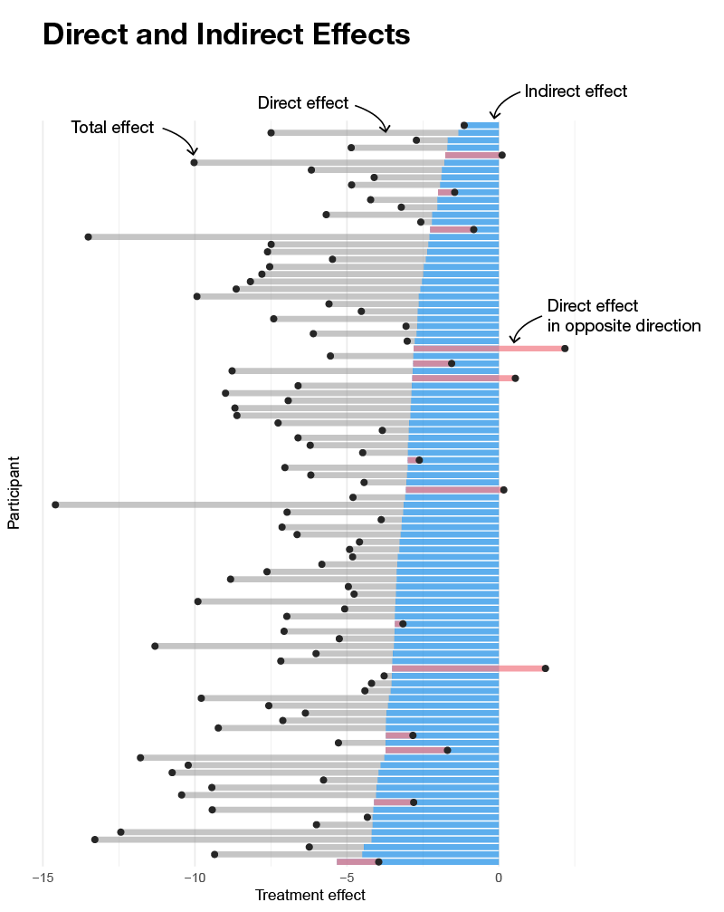
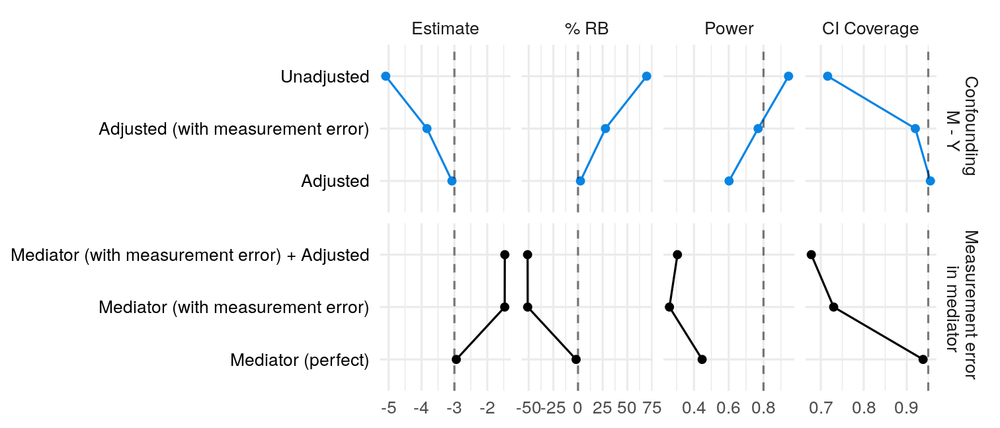

Mediation might be the ultimate example of how a method continues to be used despite a vast number of papers and textbooks describing the extremely strong assumptions required to estimate unbiased effects. My aim with this post is not to show some fancy method that could help reduce bias; rather I just want to present a small simulation-based example of the underappreciated consequences of measurement error and confounding. There's been many other people making the same point, for instance, Dunn & Bentall (2007) expressed some strong concerns about investigating mediators in psychological treatment studies:

> “The assumptions concerning the lack of hidden confounding and 
measurement errors are very rarely stated, let alone their validity discussed.
One suspects that the majority of investigators are oblivious of these two
requirements. **One is left with the unsettling thought that the thousands of
investigations of mediational mechanisms in the psychological and other literatures
are of unknown and questionable value.**” (p. 4743)

# The causal mediation model
In all examples, I assume that mediation is investigated in a randomized controlled trial where treatment allocation is randomized. The treatment is a cognitive-behavioral therapy (CBT), and we want to estimate the indirect effect of homework completion, and the hypothesis is that a non-trivial amount of the treatment effect is mediated by exposure-based homework adherence. The figure bellow presents three different scenarios that I will simulate.

* In (a), the relationship between the mediator and the outcome is confounded, but neither the mediator nor the confounder is measured with error. 
* In (b), the confounder is measured with error, I assume independent and nondifferential measurement error (i.e., classical measurement error).
* In (c), there's no confounding, but now the mediator is measured with error. 



The causal estimands are most clearly expressed using the potential outcomes framework, where the indirect effect for a single patient (Imai, Keele, & Tingley, 2010), is written as,
$$ 
\text{indirect effect} = Y_i(1, M_i(1)) - Y_i(1, M_i(0))
$$
and the direct effect of the treatment is,
$$ 
\text{direct effect} = Y_i(1, M_i(t)) - Y_i(0, M_i(t)).
$$
$M_i(1)$ is the level of the mediator under the treatment and $M_i(0)$ under the control, and $Y_i(1, M_i(1))$ is thus the outcome after treatment with the mediator at the natural level realized under the treatment. The subscript *i* indicates that these effects can be different for each individual. Just as with treatment effects, all these potential outcomes cannot be observed for every patient, but we can estimate the average causal effects. The indirect effect tells us "[w]hat change would occur to the outcome if one changes the mediator from the value that would be realized under the control condition, $M_i(0)$, to the value that would be observed under the treatment condition, $M_i(1)$, while holding the treatment status at *t*" (Imai, Keele, & Tingley,  2010, p. 311).

# Generate the data
We'll use the following packages. The simulations are performed using `powerlmm`, and the models are fit using `brms`. 

```r
library(brms)
library(purrr)
# 0.5.0 DEV VERSION, not on CRAN
library(powerlmm)
library(dplyr)
library(ggplot2)
```


We need to create a custom function that simulates the data. 


```r
#' Create mediation data 
#' using potential outcomes
#'
#' @param n total number of participants
#' @param b_pre_M Effect of pretest values on M1
#' @param b_pre_Y Effect of pretest values on Y
#' @param b_M1 Effect of M1 on outcomes
#' @param b_TX Direct effect of TX
#' @param pre_M Mean of pre
#' @param M1_M Mean of M1, ignoring contribution of confounder
#' @param M_me_sd SD of mediator's measurement error 
#' @param pre_me_sd SD of pretest confound's measurement error 
#' @param ... 
#'
#' @return a tibble
sim_data <- function(n,
                     b_pre_M,
                     b_pre_Y,
                     b_M1,
                     b_TX,
                     pre_M = 10,
                     M1_M = 2.5,
                     M_me_sd = 0,
                     pre_me_sd = 0,
                     ...) {

    tibble::tibble(
        # pretest for Y
        pre = rnorm(n, pre_M, 2),
        # treatment assigment
        TX = rbinom(n, 1, 0.5),
        # Mediator in control, 0 for all
        M0 = 0, 
        # Mediator under treatment
        M1 = rnorm(n, M1_M, 1) + b_pre_M * pre,
        # Y(0, M(0)), outcome in control when mediator at control levels
        Y0_M0 = 3 + b_pre_Y * pre + rnorm(n, 0, 2),
        # Y(0, M(1)), outcomes in control when mediator at TX levels
        Y0_M1 = Y0_M0 + b_M1 * M1,
        # Y(1, M(0)), outcomes in TX when mediator at control levels
        Y1_M0 = 3 + b_TX + b_pre_Y * pre + rnorm(n, 0, 2),
        # Y(1, M(1)), outcomes in TX when mediator at TX levels 
        Y1_M1 = Y1_M0 + b_M1 * M1,
        # Mediator
        M = (TX==0) * M0 + (TX==1) * M1,
        # Mediator with error
        M_me = (TX==0) * M0 + (TX==1) * (M1 + rnorm(n, 0, M_me_sd)),
        # Pretest with error
        pre_me = pre + rnorm(n, 0, pre_me_sd),
        # Outcome
        y = (TX==0) * Y0_M0 + (TX==1) * Y1_M1
    )

}
```

Let's pass this function to `powerlmm` as a custom model.


```r
ds <- study_design(custom = TRUE)

# confounding
p <- study_parameters(ds,
                      n = 100,
                      b_pre_M = -0.25,
                      b_pre_Y = 0.5,
                      b_TX = -3,
                      b_M1 = -0.6,
                      pre_M = 10,
                      M1_M = 7.5,
                      pre_me_sd = 1.5,
                      M_me_sd = 1,
                      data_gen = sim_data)
```


Since this is a custom model, we need to define the true parameter values if we want to calculate the coverage of the CIs automatically.

```r
# The true parameter values
# used by powerlmm to calculate CI coverage etc
# 
# Uninteresting paras are set to 0, could prob. be NA instead
indirect <- with(p, b_M1 * (M1_M + b_pre_M * pre_M))
direct <- p$b_TX
params <- list("fixed" = list("M_Intercept" = 0,
                             "y_Intercept" = 0,
                             "M_TX" = 0,
                             "y_M" = 0,
                             "y_TX" = 0,
                             "indirect" = indirect,
                             "direct" = direct,
                             "total" = indirect + direct,
                             "prop_mediated" = indirect/(indirect + direct)),
              "random" = list("sigma_M" = 0,
                              "sigma_y" = 0))

p$params <- params
params$fixed[c("indirect", 
              "direct", 
              "total", 
              "prop_mediated")]
```

```
## $indirect
## [1] -3
## 
## $direct
## [1] -3
## 
## $total
## [1] -6
## 
## $prop_mediated
## [1] 0.5
```

Let's generate a large data set to look at the values for the true causal mediation model.

```r
pn <- p
pn$n <- 5e4
dn <- simulate_data(pn)
dn %>%
    summarise(indirect = mean(Y1_M1 - Y1_M0),
              direct = mean(Y1_M1 - Y0_M1),
              Z_M = mean(M1 - M0),
              total = mean(Y1_M1 - Y0_M0),
              prop_mediated = indirect/total)
```

```
## # A tibble: 1 x 5
##   indirect direct   Z_M total prop_mediated
##      <dbl>  <dbl> <dbl> <dbl>         <dbl>
## 1    -3.00  -2.99  4.99 -5.99         0.500
```

We can see that the average indirect effect of exposure-based homework is -3, and that the average direct effect is -3 (effects transmitted via other mechanisms). Thus, the total treatment effect is 6 point reduction, and 50% of that effect is mediated by homework adherence.

We can also take a random sample of 100 participants and look at the individual-level effects. The figure below shows the direct, indirect, and total effects for these 100 participants. We see that the effects vary substantially on the individual level. In reality, we can't know if the individual-level effects vary or if they are constant for all participants. 


# Run the simulation
Let's first define the simulations for the scenarios with confounding, i.e., (a) and (b). We've already defined the measurement error, cor(pre, pre*) = 0.8. 

```r
dn %>% summarise(cor(pre, 
                     pre_me))
```

```
## # A tibble: 1 x 1
##   `cor(pre, pre_me)`
##                <dbl>
## 1              0.799
```

We'll fit all models using `brms`, there are other packages that can fit these models (e.g., `mediation` which includes a bunch of useful tools), but as I'll use brms as `powerlmm` already has methods to extract the results.


```r
# No adjustment
d <- simulate_data(p)
fit_b <- brm(bf(M ~ TX) +
             bf(y ~ M + TX) +
             set_rescor(FALSE),
             data = d)

# Adjust for pretest of outcome
fit_b_pre <- brm(bf(M ~ pre + TX) +
                 bf(y ~ pre + M + TX) +
                 set_rescor(FALSE),
                 data = d)
```

We also need to add a function that will calculate the indirect and direct effects. 


```r
summarize_model <- function(fit, d) {
    summary_func <- function(x) {
        data.frame("estimate" = mean(x),
                   "se" = sd(x),
                   "pval" = NA,
                   "df" = NA,
                   "df_bw" = NA,
                   "CI_lwr" = quantile(x, 0.025),
                   "CI_upr" = quantile(x, 0.975))
    }
    
    posterior_samples(fit) %>%
        transmute(indirect = b_M_TX * b_y_M,
                  direct = b_y_TX,
                  total = indirect + direct,
                  prop_mediated = indirect/total) %>%
        map_df(summary_func,
               .id = "parameter")
}
```

We can then create three simulation formulas.


```r
f0 <- sim_formula(fit_b,
                  post_test = summarize_model)

f1 <- sim_formula(fit_b_pre,
                  post_test = summarize_model)

# Just rename pre_me to pre
# pre now have measurement error
add_pre_me <- function(d, ...) {
    d$pre <- d$pre_me
    d
}
f1_me <- sim_formula(fit_b_pre,
                     post_test = summarize_model,
                     data_transform = add_pre_me)
```

Then we just run the simulation. This code can also be used to calculate power for a mediation study.


```r
# manually start clusters
# need to load packages
cl <- parallel::makeCluster(12)
parallel::clusterEvalQ(cl, {
    library(dplyr)
    library(purrr)
})

res <- simulate(p,
                nsim = 1000,
                cores = 12,
                cl = cl,
                formula = sim_formula_compare("M" = f0,
                                              "M_pre" = f1,
                                              "M_pre_me" = f1_me))
saveRDS(res, "med_sim.Rds")
```

The simulation for the scenario with measurement error in the mediator is performed in the same way. The correlation between the mediator measured with error (M* = `M_me`) and the true mediator (M) is about 0.7, in the treatment group.

```r:collapsed=true
# Remove confounding
p1 <- p
p1$b_pre_M <- 0
p1$M1_M <- 5

# Sim formulas
f0 <- sim_formula(fit_b,
                  post_test = summarize_model)

add_M_me <- function(d, ...) {
    d$M <- d$M_me
    d
}
f1_me <- sim_formula(fit_b,
                     post_test = summarize_model,
                     data_transform = add_M_me)
f1_me_pre <- sim_formula(fit_b_pre,
                         post_test = summarize_model,
                         data_transform = add_M_me)

# manually start clusters
# need to load packages
cl <- parallel::makeCluster(12)
parallel::clusterEvalQ(cl, {
    library(dplyr)
    library(purrr)
})


res2 <- simulate(p1,
                nsim = 1000,
                cores = 12,
                cl = cl,
                formula = sim_formula_compare("M" = f0,
                                              "M_me" = f1_me,
                                              "M_me_pre" = f1_me_pre))
saveRDS(res2, "med_me_sim.Rds")
```

# Simulation results
Now we just have to summarize the results. First, we create two functions to extract the relevant results.

```r:collapsed=true
res <- readRDS("med_sim.Rds")
res_me <- readRDS("med_me_sim.Rds")

sum_res <- summary(res)
sum_res_me <- summary(res_me)

extract_summary <- function(model) {
  model$FE %>% 
    filter(parameter %in% c("indirect", 
                            "direct", 
                            "total", 
                            "prop_mediated"))
}

summary_table <- function(res) {
  map_df(res$summary, 
                    extract_summary, 
                    .id = "label") %>% 
    transmute(label, parameter, 
              M_est, theta,
              "%_RB" = (M_est - theta)/theta * 100,
              Power, CI_Cover)
}
```

Then we can plot the results for the indirect effects.


```r:collapsed=true
library(tidyr)
x <- summary_table(sum_res) 
x <- x %>% 
  filter(parameter == "indirect") %>% 
  mutate(sim = "confounding",
         label = factor(label, levels = c("M_pre",
                                          "M_pre_me",
                                          "M"), 
                        labels = c("Adjusted", 
                                   "Adjusted (with measurement error)", 
                                   "Unadjusted")))

x_me <- summary_table(sum_res_me) 
x_me <- x_me %>% 
  filter(parameter == "indirect") %>% 
  mutate(sim = "ME", 
         label = factor(label, levels = c("M", 
                                          "M_me", 
                                          "M_me_pre"), 
                        labels = c("Mediator (perfect)", 
                                   "Mediator (with measurement error)", 
                                   "Mediator (with measurement error) + Adjusted"))
         )

tmp <- rbind(x, x_me)
tmp_long <- gather(tmp, variable, value, -sim, -label, -parameter, -theta) 
variables <- c("M_est", "%_RB", "Power", "CI_Cover")
tmp_long <- mutate(tmp_long, 
                   variable = factor(variable, 
                                     levels = variables, 
                                     labels = c("Estimate", 
                                                "% RB", 
                                                "Power", 
                                                "CI Coverage")),
                   sim = factor(sim,
                                levels = c("confounding", 
                                           "ME"),
                                labels = c("Confounding \n M - Y", 
                                           "Measurement error \n in mediator"))
                   )
tmp_hline <- data.frame(variable = unique(tmp_long$variable),
                        yintercept = c(-3, 0, 0.8, 0.95))

p_res <- ggplot(tmp_long, aes(label, value, color = sim)) + 
  geom_line(aes(group = variable)) +
  geom_point() +
  geom_hline(data = tmp_hline, aes(yintercept = yintercept), 
             color = "black",
             linetype = "dashed",
             alpha = 0.5) +
  facet_grid(sim~variable, drop = TRUE, scales = "free") +
  labs(x = NULL, 
       y = NULL) +
  coord_flip() + 
  scale_color_manual(values = c("#0984e3",
                                "black")) +
  theme_minimal() +
  theme(legend.position  = "none",
        axis.text.y = element_text(color = "black"))
```




For the scenarios with confounding we see that:

* failing to account for baseline values of the outcome variable in the mediation analysis leads to an overestimation of the indirect effect of homework adherence. Participants with fewer problems at baseline are more likely to complete more homework, and they are also likely to have fewer problems at posttest,  
* adjusting for a confounder that's perfectly measured yields unbiased estimates (assuming no other hidden confounding), adjusting for a confounder measured with error is an improvement but there's still residual confounding leading to bias. 

When there's measurement error in the mediator we see that:

* the indirect effect is attenuated.
* In this case, adjusting for pretest values does not reduce bias, but it does reduce the standard errors and leads to increased power. 


Here are also tables with the results for the direct and total effect, as well.

```r
summary_table(sum_res) %>% 
  kable(digits = 2)
```


|label    |parameter     | M_est| theta|   %_RB| Power| CI_Cover|
|:--------|:-------------|-----:|-----:|------:|-----:|--------:|
|M        |indirect      | -5.09|  -3.0|  69.64|  0.94|     0.72|
|M        |direct        | -0.90|  -3.0| -69.98|  0.08|     0.71|
|M        |total         | -5.99|  -6.0|  -0.17|  1.00|     0.96|
|M        |prop_mediated |  0.86|   0.5|  71.83|  0.94|     0.72|
|M_pre    |indirect      | -3.07|  -3.0|   2.49|  0.60|     0.96|
|M_pre    |direct        | -2.92|  -3.0|  -2.52|  0.51|     0.96|
|M_pre    |total         | -6.00|  -6.0|  -0.01|  1.00|     0.95|
|M_pre    |prop_mediated |  0.52|   0.5|   3.34|  0.59|     0.96|
|M_pre_me |indirect      | -3.84|  -3.0|  27.84|  0.77|     0.92|
|M_pre_me |direct        | -2.17|  -3.0| -27.76|  0.31|     0.93|
|M_pre_me |total         | -6.00|  -6.0|   0.04|  1.00|     0.96|
|M_pre_me |prop_mediated |  0.64|   0.5|  28.96|  0.76|     0.92|


```r
summary_table(sum_res_me) %>% 
  kable(digits = 2)
```


|label    |parameter     | M_est| theta|   %_RB| Power| CI_Cover|
|:--------|:-------------|-----:|-----:|------:|-----:|--------:|
|M        |indirect      | -2.94|  -3.0|  -1.94|  0.45|     0.94|
|M        |direct        | -3.09|  -3.0|   2.84|  0.44|     0.94|
|M        |total         | -6.03|  -6.0|   0.45|  1.00|     0.95|
|M        |prop_mediated |  0.49|   0.5|  -1.41|  0.44|     0.94|
|M_me     |indirect      | -1.47|  -3.0| -51.03|  0.26|     0.73|
|M_me     |direct        | -4.56|  -3.0|  51.91|  0.94|     0.75|
|M_me     |total         | -6.03|  -6.0|   0.44|  1.00|     0.95|
|M_me     |prop_mediated |  0.25|   0.5| -50.61|  0.25|     0.74|
|M_me_pre |indirect      | -1.47|  -3.0| -51.13|  0.30|     0.68|
|M_me_pre |direct        | -4.56|  -3.0|  52.06|  0.96|     0.70|
|M_me_pre |total         | -6.03|  -6.0|   0.47|  1.00|     0.95|
|M_me_pre |prop_mediated |  0.25|   0.5| -50.80|  0.30|     0.68|


# Summary
Measurement error and confounding is a huge problem for mediation analyses, and there's no easy solution. In real life, we can expect both confounding and measurement error in the mediator and confounders. There's likely to be multiple sources of confounding, both related to baseline variables and post-randomization variables (i.e., things happening after treatment allocation). Assumptions regarding the lack of hidden confounding and measurement error are very hard to defend.

# References

* Dunn, G., & Bentall, R. (2007). Modelling treatment-effect heterogeneity in randomized controlled trials of complex interventions (psychological treatments). Statistics in Medicine, 26(26), 4719–4745. https://doi.org/10.1002/sim.2891
* Imai, K., Keele, L., & Tingley, D. (2010). A general approach to causal mediation analysis. Psychological Methods, 15(4), 309–334. https://doi.org/10.1037/a0020761
